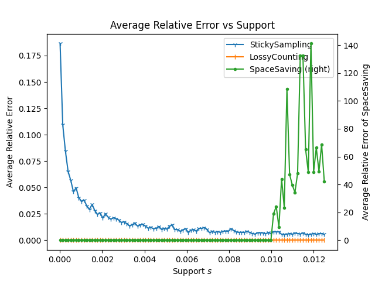
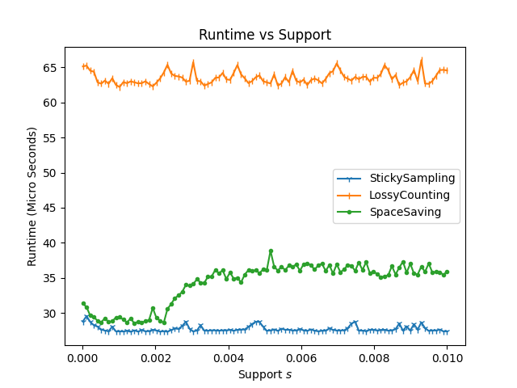

# items-frequent-estimate
Estimate the most frequent items in a data stream

## Introduction
Three algorithms are implemented in this project to estimate the most frequent items of a data stream.
They are StickySampling, LossyCounting, and SpaceSaving. 

## Try it
With `python3` installed, simply run `python3 -m pip install -r requirements.txt`.
## Results
Experiments were taken on macOS Catalina version 10.15.7 (19H2) with the following hardware

- CPU: 1.8 GHz Quad-Core Intel Core i5
- Memory: 8 GB 2133 MHz LPDDR3
- Disk: WDC PC SN720 SDAPNTW-512G-1127 SSD

The same experiments can be taken with the command `python main.py`, and similar graphics will be generated automatically.

## Conclusion

If the number of distinct items is known(estimable) and space is very lacked,
 SpaceSaving is the best choice since it uses a few spaces and has better performance with the proper number of fixed counters.
 Otherwise, if the number is invisible, LossyCounting gives a very high and stable precision but it is a little slower than StickySampling and also uses more space. If one prefers a stable precision and 
 does not mind the runtime and space difference, LossyCounting is a better choice than StickySampling.
